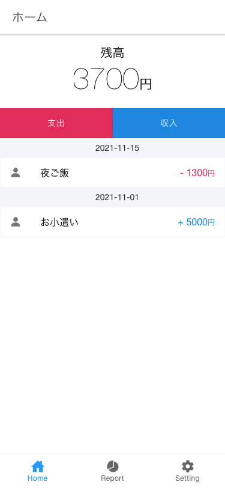

## myManager

### 概要

自分のお金の管理をするためのモバイルアプリ。
(まだ未完です...)

- 支出・収入登録
- 今月どれだけ使ったのかの確認
  等の機能が存在。

### UI



### 実行方法

```bash
git clone git@github.com:shoma3571/myManager.git
cd myManager

npm start
# open your browser on http://localhost:4200
```

### Build

```bash
ionic cordova build android
# デバイス接続確認
adb devices
# install
adb install -r platform/...
```
